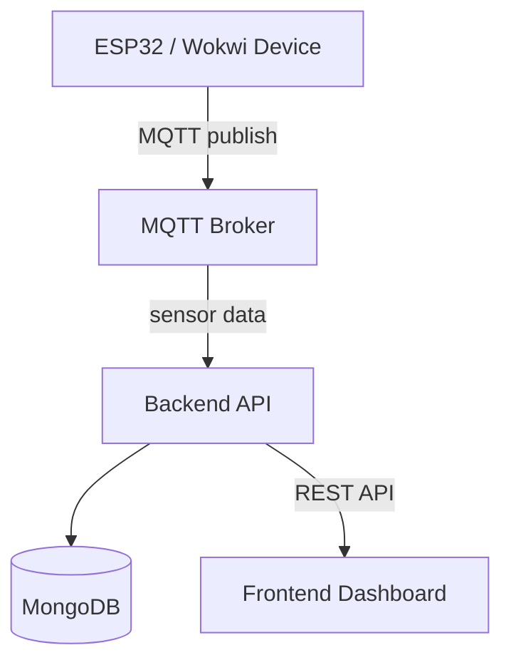

# IoT Backend API

Backend service for the 1DV027 IoT project at Linnaeus University (Spring 2026).

Written by Smilla Sollén.

---

# Overview

This backend application receives MQTT sensor data from an ESP32 device, stores the data in MongoDB, and exposes REST API endpoints for the frontend dashboard.

The project is built using:

* Node.js
* Express
* MongoDB
* Mongoose
* MQTT.js

---

# Features

* MQTT subscription for real-time sensor data
* MongoDB storage for historical data
* REST API endpoints
* Data validation
* Time-series data handling
* Historical data filtering and sampling

---

# Project Structure

```txt id="v6hb9x"
src/
├── config/
├── controllers/
├── models/
├── routes/
├── services/
├── utils/
├── app.js
└── server.js
```

---

# Installation

Clone the repository:

```
git clone [repository-url]
```

Install dependencies:

```
npm install
```

---

# Environment Variables

Create a `.env` file in the project root:

```env id="pyudwk"
PORT=3020

MONGO_URI=your_mongodb_connection_string

MQTT_BROKER=your_broker_url
MQTT_TOPIC=your_topic

MQTT_USER=your_username
MQTT_PASSWORD=your_password
```

---

# Running the Server

Development mode:

```bash id="fr4f4y"
npm run dev
```

Production mode:

```bash id="p8wxy6"
npm start
```

---

# MQTT Integration

The backend connects to an MQTT broker and subscribes to a sensor topic.

Example topic:

```txt id="ycc5y8"
lnu/iot/[student_id]/sensor
```

Incoming messages are validated and stored in MongoDB.

Example payload:

```json id="kk5g6f"
{
  "lux": 320,
  "cct": 5400,
  "rgb": {
    "r": 120,
    "g": 90,
    "b": 70
  },
  "timestamp": 1710063386
}
```

---

# Database Strategy

MongoDB is used for storing time-series sensor data.

The backend uses a Mongoose schema called `SensorData`.

Stored fields:

* deviceTimestamp
* serverTimestamp
* lux
* cct
* rgb values

Example schema:

```js id="5hy3hz"
const sensorDataSchema = new mongoose.Schema({

    deviceTimestamp: {
        type: Date,
        required: true
    },

    serverTimestamp: {
        type: Date,
        default: Date.now
    },

    lux: {
        type: Number,
        required: true
    },

    cct: {
        type: Number,
        default: null
    },

    rgb: {

        r: Number,
        g: Number,
        b: Number
    }

})
```

---

# API Endpoints

## GET `/api/data`

Returns historical sensor data.

### Query Parameters

| Parameter | Description                 |
| --------- | --------------------------- |
| `hours`   | Number of hours to retrieve |

Example:

```http id="4wkn83"
GET /api/data?hours=48
```

---

## GET `/api/data/:id`

Returns a specific sensor data entry by ID.

Example:

```http id="eh7g8f"
GET /api/data/6824fa...
```

---

# Data Handling

Historical data is:

* filtered by timestamp
* sorted chronologically
* sampled before being returned
* limited to a maximum number of results

This improves frontend performance and reduces unnecessary payload sizes.

---

# Architecture Overview



---

# License

This project was developed as part of the 1DV027 course at Linnaeus University.
